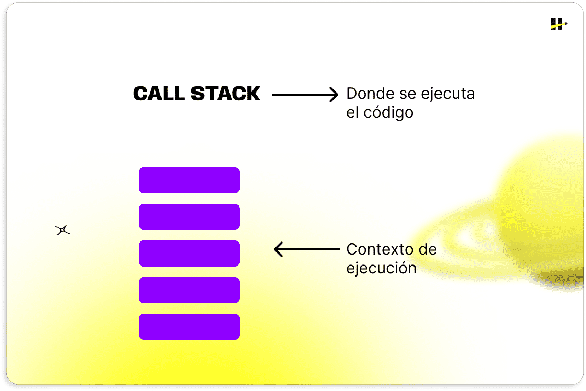
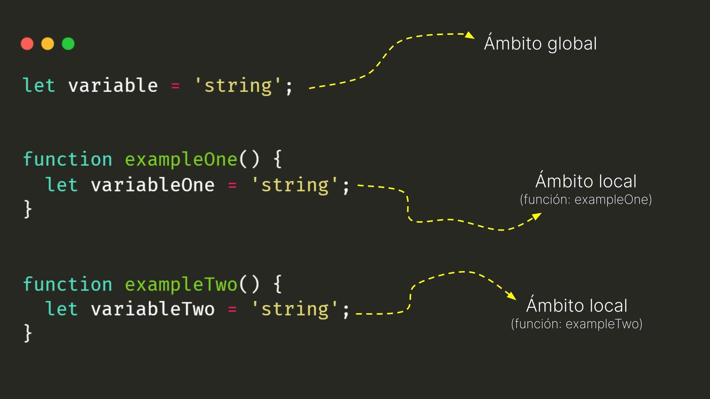
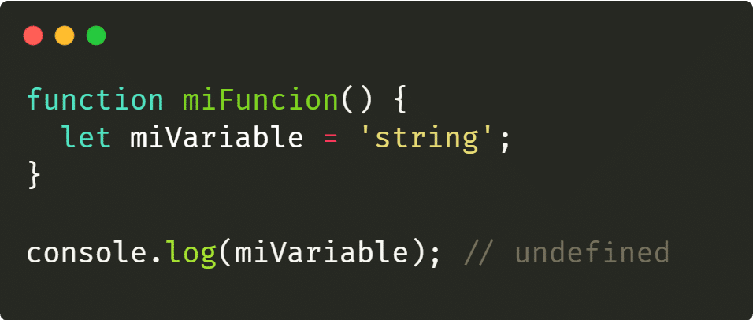

# Conceptos clave

## Memory Heap

Es la región o espacio de memoria del PC en la que se asignan variables cuando son creadas. Allí se almacenan los datos creados durante la ejecución, como objetos, arrays y variables.

## Call Stack

Es el mecanismo que organiza la ejecución de las funciones en una aplicación. Apila los entornos en los que cada fragmento del código se ejecuta. 

# Relación entre Memory Heap y Call Stack

En el call stack, cada vez que se llama a una función, se añade un nuevo contexto en la parte superior de la pila que contiene toda la información sobre la función en curso.


De esta manera, al momento de ejecutar una función, se crea un nuevo contexto de ejecución y se carga en el memory heap toda la información contenida dentro la función como variables, parámetros y otros detalles. Una vez esta función termina de ejecutarse, el contexto de ejecución se destruye y continúa con el siguiente contexto de la call stack.



---

## Global vs. Local

* **GLOBAL**

El **contexto de ejecución global** es el ámbito en el que está escrito el código fuera de cualquier función o bloque específico. En este contexto las variables y funciones se definen y pueden ser accedidas desde cualquier parte del código, ya sea usar los valores de las variables o ejecutar las funciones desde dentro de otras funciones.



---

* **LOCAL**

Por otro lado, tenemos al **contexto de ejecución local**, el cual se refiere al entorno en el que se ejecuta un bloque de código específico, generalmente dentro de una función o un bloque delimitado por llaves ({}). Dentro de este contexto local, las variables y funciones declaradas son accesibles solo dentro de ese bloque y no fuera de él.



---

## Ámbito léxico

Es el contexto que se busca y se resuelve el valor de una variable . En otras palabras, donde estas pueden ser referenciadas y que valores tienen.

## Hoisting

Es un comportamiento de JavaScript en que las declaraciones de las variables y funciones son "movidas" o "elevadas" internamente al inicio de su ámbito léxico antes de que el código comience a ejecutarse.

# Closures

Son funciones que tienen acceso a variables definidas en su ámbito léxico, incluso luego de haber terminado su ejecución.

En otras palabras, es la capacidad que posee una función de recordar y acceder a variables de su ámbito léxico, aun que esta ya se haya terminado de ejecutar.

**Las closures se crean cuando una función es declarada dentro de otra y la función interna hace referencia a variables de la externa.**

```js
function funcionPadre() {
    let variableExterna = "Soy externa";

    function funcionRetornada () {
        console.log(variableExterna);
    }

    return funcionRetornada;
}

const funcionHija = funcionPadre();

funcionHija(); // Soy externa
```
---
## Resumen


