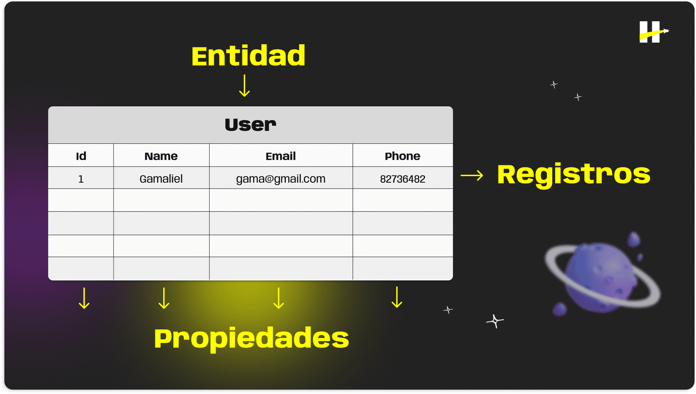
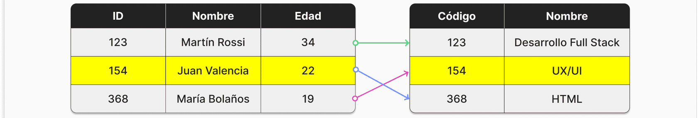
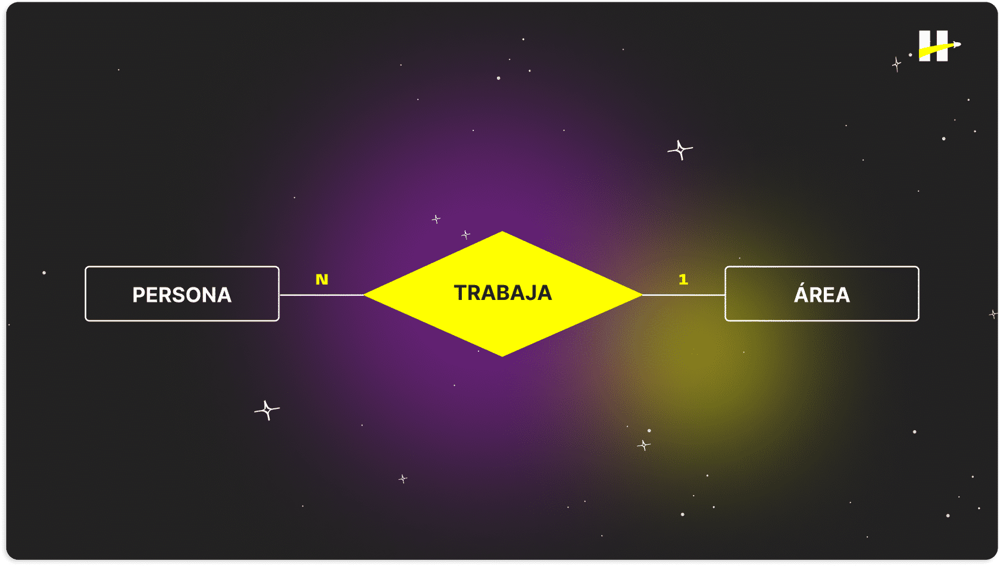
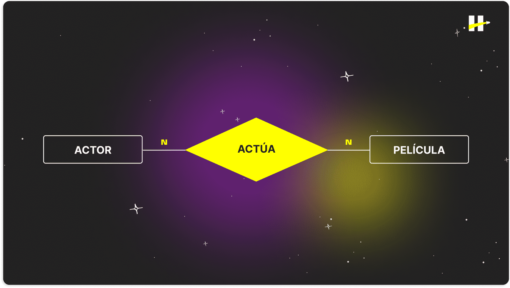
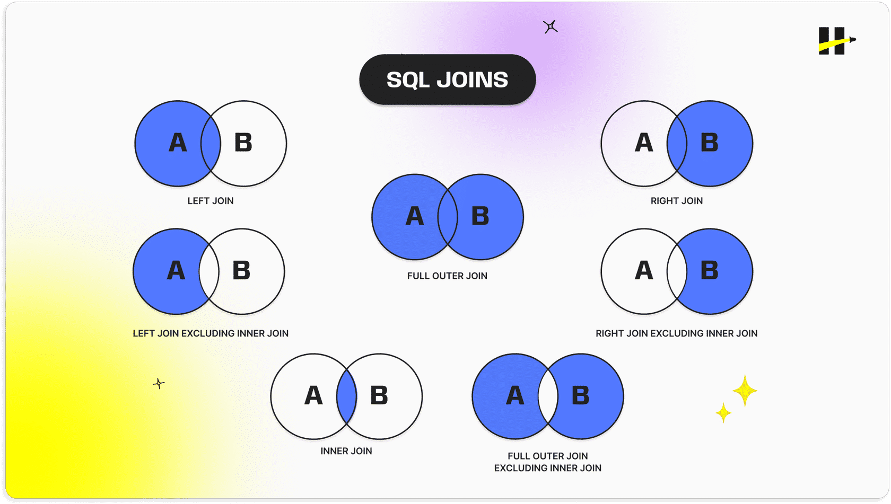

# Bases de datos relacionales

Una base de datos relacional guarda información en estructuras tabulares (**tablas**) compuestas por filas y columnas, en lugar de colecciones y documentos.



Cada columna de la tabla representa los atributos o propiedades de esa entidad (por ejemplo, un identificador, nombre del usuario, email y teléfono) y las filas contienen los registros o instancias particulares de esa entidad (cada usuario individual).

Para mantener esta integridad se especifica la cardinalidad entre tablas relacionadas. La cardinalidad nos indica cuántos registros de una tabla están asociados con cuántos de otra. Por ejemplo, si tenemos dos entidades, Estudiantes y Cursos, estas podrían tener registros relacionados entre sí:




Existen **tres** tipos posibles de cardinalidad dentro del modelo **relacional**:

* **Uno a uno (1:1)**

    Cada fila en una tabla está relacionada a lo sumo con una fila en la otra tabla, y viceversa.

    En este caso, podemos definir, por ejemplo, que una entidad Persona se relacione con una entidad Area (nos referimos al "área" de una empresa), bajo la relación “dirigir”.

    

* **Uno a muchos (1:N)**

    Cada fila en la tabla "A" puede estar relacionada con varias filas en la tabla "B", pero cada fila en la tabla "B" solo puede estar relacionada con una fila en la tabla "A".

    Continuando con las entidades del ejemplo anterior, diremos que, bajo la relación “trabajar”, podemos considerar que “muchas personas trabajan en una sola área y, de la misma manera, en una sola área trabajan muchas personas”.

    

* **Muchos a muchos (N:M)**

    Varias filas en una tabla pueden estar relacionadas con varias filas en la otra tabla.

    Para este caso y considerando dos entidades, Actor y Película, bajo la relación “actuar”, es pertinente decir que “cada actor puede actuar en muchas películas y, de forma análoga, en cada película actúan muchos actores”.

    

# SQL

SQL (Structured Query Language) es un lenguaje estandarizado que permite realizar queries de información a una base de datos relacional. Estas queries pueden ser consultas, actualizaciones, inserciones o eliminación de datos. Es un *lenguaje declarativo*, es decir, el usuario indica qué operación y qué resultado desea obtener y el sistema de gestión se encarga del procesamiento de la solicitud.

## PostgreSQL

Es una base de datos de código abierto y de alto rendimiento. Es hasta la fecha el sistema de gestión más utilizado en la industria. Podemos mencionar que cuenta con soporte completo para las consultas SQL e incorpora una amplia gama de tipos de datos propios y personalizados que facilitan la gestión de la información.

📢 Importante
Todos los comandos que escribas dentro de esta terminal deben terminar en punto y coma (;) para que sean ejecutados correctamente.

Para crear una base de datos se usa el siguiente comando:

```sql
    CREATE DATABASE <nombre de la BD>;
```

Para poder visualizar nuestras bases de datos dentro de PostgreSQL debemos ejecutar el comando **\l** en la línea de comandos.

Para conectarnos a empleados y trabajar sobre ella debemos utilizar el comando **\c** especificando el nombre de la BD.

Para crear una tabla:

```sql
    CREATE TABLE <nombre de la tabla>(propiedades);
```

## Constraints y tipos de datos

Las propiedades (columnas) de cada entidad deben tener asociado un tipo de dato que nos permite asegurar que la información de todas las instancias o registros de dicha tabla sea estandarizada, limitando la información que puede ser almacenada en ella. Algunos ejemplos de estos tipos de datos son:

* **Character varying - varchar(n)**

    Para strings que contengan entre 1 y n caracteres.

* **Inteher - int**

    Integers de 4 bytes, es decir, un número tan grande como 2 a la potencia 32.

* **Date**

    Fechas de calendario con estructura año, mes, dia.

## Ejemplos de comnados

Para ingresar a la base de datos se hace a través de **SQL Shell**

Comando para iniciar el servicio:
```sql
Server [localhost]: Enter
Database [postgres]: Enter
Port [5432]: Enter
Username [postgres]: Contraseña no aparece
Contraseña para usuario postgres:
```
Comando de ejemplo para crear los encabezados de la tabla:

```sql
CREATE TABLE peliculas (
    id SERIAL PRIMARY KEY,
    title VARCHAR(100),
    year INTEGER,
    duration INTERVAL
);
```
1. id: Esta columna es de tipo SERIAL, lo que significa que se autoincrementará automáticamente cada vez que insertes una nueva fila. Es la clave primaria de la tabla.
2. title: Esta columna es de tipo VARCHAR(100), que puede almacenar cadenas de caracteres de hasta 100 caracteres de longitud, y almacenará el nombre de la película.
3. year: Esta columna es de tipo INTEGER, que almacenará el año de lanzamiento de la película.
4. duration: Esta columna es de tipo INTERVAL, que almacenará la duración de la película en formato de intervalo de tiempo.


Ejemplo de inserción de registro

```sql
INSERT INTO peliculas (title, year, duration) 
VALUES ('Los Vengadores', 2012, '2 hours 23 minutes');
```

Para insertar múltiples registros por ejemplo:


```sql
INSERT INTO peliculas (title, year, duration) 
VALUES 
    ('Titanic', 1997, '3 hours 14 minutes'),
    ('Avatar', 2009, '2 hours 42 minutes'),
    ('The Dark Knight', 2008, '2 hours 32 minutes'),
    ('Inception', 2010, '2 hours 28 minutes'),
    ('Forrest Gump', 1994, '2 hours 22 minutes'),
    ('The Shawshank Redemption', 1994, '2 hours 22 minutes'),
    ('The Godfather', 1972, '2 hours 55 minutes'),
    ('Pulp Fiction', 1994, '2 hours 34 minutes'),
    ('The Matrix', 1999, '2 hours 16 minutes'),
    ('Interstellar', 2014, '2 hours 49 minutes');
```

Ejemplo para pedir todos los registros con el mismo dato en común:

```sql
SELECT * FROM peliculas 
WHERE year = 1994;
```

Ejemplo para ordenar toda la tabla respecto a un dato:

```sql
SELECT * FROM peliculas 
ORDER BY duration;
```

Filtrar y ordenar:

```sql
SELECT * FROM peliculas 
WHERE year = 1994
ORDER BY duration;

```

Para la modificación de un dato:

```sql
UPDATE peliculas 
SET year = 1994 
WHERE id = 6;
```

Para eliminar un registro:


```sql
DELETE FROM peliculas 
WHERE id = 3;
```

# Relaciones en SQL

## Join

Cuando realizamos solicitudes lo más común es que esa solicitud dependa de la información de dos o más tablas en función de la relación entre ellas. Para poder crear estas querys, SQL nos permite utilizar la cláusula llamada JOIN para unir la información entre tablas.

**Ejemplos para relacionar datos**

Para relacionar un solo dato:
```sql
UPDATE peliculas
SET director_id = 1
WHERE id = 2;
```
Para relacionar varios datos:
```sql
UPDATE peliculas
SET director_id = 
    CASE 
        WHEN id = 2 THEN 1
        WHEN id = 4 THEN 2
        WHEN id = 8 THEN 4
        ELSE director_id
    END
WHERE id IN (2, 4, 8);
```

## SQL Joins



## Operadores de comparación

SQL integra también herramientas para filtrar y comparar datos de nuestras consultas a partir de operadores. Estos pueden ser utilizados para buscar registros con características muy particulares respecto a sus valores.

👀Para crear las querys que nos permiten realizar estas solicitudes tenemos mútiples herramientas que nos ayudan a definir condiciones de filtro u ordenamiento. Una de ellas son los operadores de comparación. Estos operadores nos permiten utilizar cláusulas como WHERE o JOIN para comparar dos valores y devolver un resultado booleano que nos permitirá filtrar la información.


